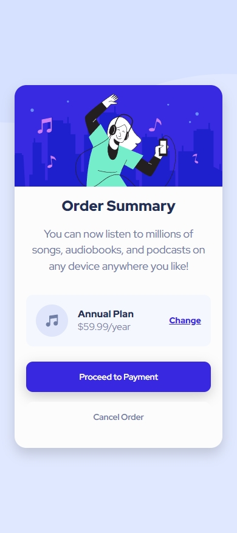
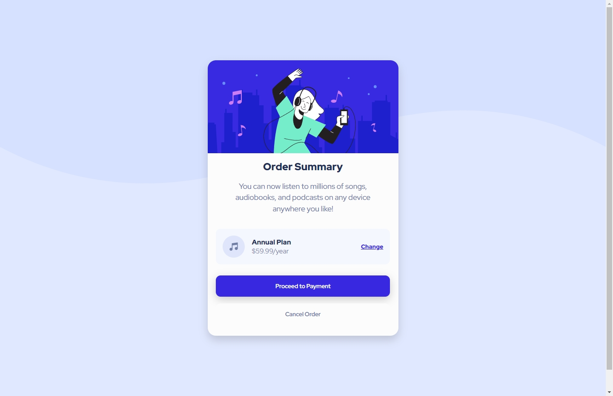

# Frontend Mentor - Order summary card solution

This is a solution to the [Order summary card challenge on Frontend Mentor](https://www.frontendmentor.io/challenges/order-summary-component-QlPmajDUj). Frontend Mentor challenges help you improve your coding skills by building realistic projects. 


## Table of contents

- [Overview](#overview)
  - [The challenge](#the-challenge)
  - [Screenshot](#screenshot)
  - [Links](#links)
- [My process](#my-process)
  - [Built with](#built-with)
  - [What I learned](#what-i-learned)
  - [Continued development](#continued-development)
  - [Useful resources](#useful-resources)
  - [AI Collaboration](#ai-collaboration)
- [Author](#author)
- [Acknowledgments](#acknowledgments)


## Overview

### The challenge

Users should be able to:

- See hover states for interactive elements

### Screenshot


Mobile Design





Desktop Design





### Links

- Solution URL: [solution URL here](https://github.com/CasteLeonardo/order-summary-component-main)
- Live Site URL: [live site URL here](https://llano-order-summary-component.netlify.app/)


## My process

### Built with

- Semantic HTML5 markup
- CSS custom properties
- Flexbox
- CSS Grid
- Mobile-first workflow
- Responsive design with media queries
- BEM naming convention


### What I learned

This project gave me more practice with creating responsive layouts using a mobile-first approach. I focused on structuring the component with semantic HTML and organizing the styles using the BEM naming convention.

I also practiced using CSS Grid to organize the annual plan section, allowing the icon, plan information, and change link to be positioned consistently across different screen sizes.

For example:

```css
.order-summary__plan {
    display: grid;
    grid-template-columns: auto 1fr auto;
    align-items: center;
    gap: 1rem;
}
```

Another part I practiced was creating interactive hover states while keeping the visual hierarchy of the buttons clear.

I also continued practicing CSS custom properties to keep the colors and typography values organized and reusable throughout the stylesheet.


### Continued development

I want to continue improving my CSS skills, especially with:

- Creating more accurate responsive layouts
- Improving my understanding of Flexbox and CSS Grid
- Writing cleaner and more maintainable CSS
- Improving spacing, sizing, and typography to match designs more accurately
- Practicing hover and focus states for interactive elements
- Becoming more comfortable with the BEM naming convention


### Useful resources

- [Frontend Mentor](https://www.frontendmentor.io/home) - The challenge and design reference used for this project.
- [MDN Web Docs](https://developer.mozilla.org/en-US/) - Useful documentation for HTML and CSS concepts.
- [CSS-Tricks](https://css-tricks.com/) - Useful articles and guides about CSS layouts and responsive design.


### AI Collaboration

I used ChatGPT as a development assistant throughout the project.

I mainly used it to:

- Discuss possible approaches to CSS styling and hover interactions.
- Get feedback on naming conventions and code organization.
- Improve the project documentation and README.
- Discuss Git commit organization and commit messages.

The implementation and final decisions were made by me. AI was used as a tool for guidance, feedback, and brainstorming rather than as a replacement for writing and understanding the code.


## Author

- Website - [Leonardo Castellanos Portafolio](https://llanoportafolio.netlify.app/)
- Frontend Mentor - [@CasteLeonardo](https://www.frontendmentor.io/profile/CasteLeonardo)
- GitHub - [@CasteLeonardo](https://github.com/CasteLeonardo)
- Linkedin - [Leonardo Castellanos Rivera](https://www.linkedin.com/in/leonardo-castellanos-rivera/)


## Acknowledgments

Thanks to Frontend Mentor for providing the challenge and design reference used to build this project.

This project was completed independently as part of my continued practice with front-end development.

This is where you can give a hat tip to anyone who helped you out on this project. Perhaps you worked in a team or got some inspiration from someone else's solution. This is the perfect place to give them some credit.

**Note: Delete this note and edit this section's content as necessary. If you completed this challenge by yourself, feel free to delete this section entirely.**
